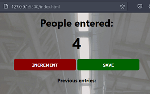
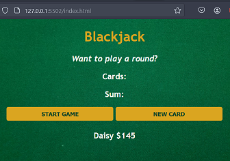
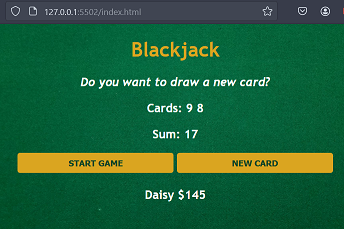
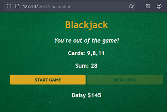
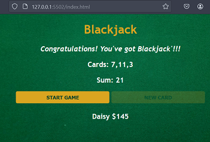
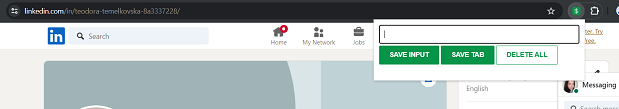
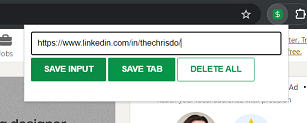
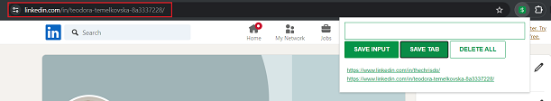

# JavaScript Programming Course Projects
by freeCodeCamp

By completing this course I succesfully made three small applications using JavaScript

<ol>
  <li>Passenger Counter App</li>
  <li>Blackjack App</li>
  <li>Lead tracker - Chrome extention app</li>
</ol>

## Passenger Counter
A simple app which saves entries on how many passengers are counted at a train station\
It has two functions: 
<li>increment - when counting passengers and </li>
<li>save - to save the counted passengers at a time as entries.</li>

\
\
\

## Blackjack 
A single player, simplified version of blackjack\
Made randomise function which gives two random cards in the range of 2-11\
If sum is < 21 user can add new card\
If sum is 21, user wins\
If sum > 21, user loses

\
\
\
\

## Lead Tracker - Chrome Extention
This Chrome extension can save anything pasted in the input, can save current tab url, list the saved data and delete it.\
The saved data is persistent

- Default view\

- Pasted in input\

- Saved input\

- Save tab url\

- Delete entries\

